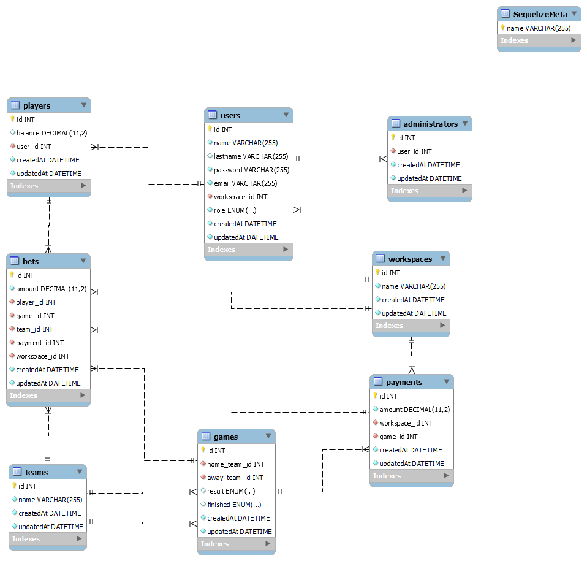

# CHARRUA BET API

<details>
  <summary>Contenido 📝</summary>
  <ol>
    <li><a href="#objetivo">Objetivo</a></li>
    <li><a href="#sobre-el-proyecto">Sobre el proyecto</a></li>
    <!-- <li><a href="#deploy-🚀">Deploy</a></li> -->
    <li><a href="#stack">Stack</a></li>
    <li><a href="#diagrama-bd">Diagrama</a></li>
    <li><a href="#instalación-en-local">Instalación</a></li>
    <li><a href="#endpoints">Endpoints</a></li>
    <li><a href="#contribuciones">Contribuciones</a></li>
  </ol>
</details>

## Objetivo

Este proyecto es una API funcional conectada a una base de datos usando sequelize y MySQL, con el objetivo de crear una página de apuestas deportivas.

## Sobre el proyecto

Este proyecto de apuestas deportivas es una aplicación web diseñada para permitir a los usuarios realizar apuestas en diferentes eventos deportivos. Proporciona un entorno seguro y confiable para que los usuarios disfruten de la emoción de las apuestas y sigan de cerca los resultados de los partidos.

La API backend proporciona las siguientes funcionalidades principales:

- **Autenticaciónde usuarios** : Permite el registro y autenticación de usuarios mediante la generación y verificación de tokens de autenticación.

- **Gestión de usuarios**: Permite crear, editar, eliminar y obtener información sobre los usuarios registrados.

- **Gestión de apuestas**: Permite realizar apuestas en eventos deportivos, obtener información sobre las apuestas realizadas y actualizar su estado.

- **Seguimiento de resultados**: Proporciona información en tiempo real sobre los resultados de los eventos deportivos y las apuestas ganadoras. (**PROXIMAMENTE**)

- **Espacios de trabajo personalizados**: Cada casa de apuestas tiene su propio espacio de trabajo donde los usuarios pueden realizar apuestas específicas para esa casa.

- **Administración de usuarios**: Los administradores de cada espacio de trabajo pueden gestionar y controlar los usuarios que tienen acceso a su plataforma.

- **Registro de usuarios**: Solo los administradores de cada espacio de trabajo pueden crear una cuenta en la plataforma para sus usuarios y acceder a todas las funcionalidades del sitio.

El proyecto de esta API sigue una estructura común de aplicaciones web desarrolladas con Node.js y Express.js. A continuación se muestra la estructura de directorios y archivos más relevante:

- app.js: El punto de entrada de la aplicación. Configura y crea la instancia del servidor Express.js.

- routes/: Contiene los archivos de enrutamiento que definen las diferentes rutas y controladores de la API.

- models/: Aquí se encuentran los modelos de Sequelize que representan las tablas de la base de datos y definen las relaciones entre ellas.

- migrations/: Contiene las migraciones de Sequelize, que se encargan de crear o modificar las tablas y campos en la base de datos.

- controllers/: Contiene los controladores de la API, que implementan la lógica de negocio para cada una de las rutas y acciones.

- middlewares/: Aquí se encuentran los middlewares, funciones que se ejecutan antes o después de las rutas para realizar tareas como autenticación, validación, etc.

- config/: Contiene archivos de configuración, como la configuración de la base de datos y otros parámetros de la aplicación.

<!-- ## Deploy 🚀
<div align="center">
    <a href="https://www.google.com"><strong>Url a producción </strong></a>🚀🚀🚀
</div> -->

## Stack

Tecnologías utilizadas:

<div align="center">
<a href="https://sequelize.org/">
    
</a>
<a href="https://www.expressjs.com/">
    
</a>
<a href="https://nodejs.org/es/">
    
</a>
<a href="https://developer.mozilla.org/es/docs/Web/JavaScript">
    
</a>
<a href="https://dev.mysql.com/doc/">
    
</a>
 </div>

## Diagrama BD



## Instalación en local

1. Clonar el repositorio
2. `$ npm install`
3. Conectamos nuestro repositorio con la base de datos
4. `$ Ejecutamos las migraciones`
5. `$ Ejecutamos los seeders`
6. `$ npm run dev`

## Endpoints

<details>
<summary>Endpoints</summary>

- AUTH

  - REGISTRAR JUGADOR (ADMIN)

          POST http://localhost:3000/auth/register

    body:

    ```js
        {
          "name": "Cristiano",
          "email": "cristiano@cristiano.com",
          "lastname": "Ronaldo",
          "password": "12345678"
        }
    ```

  - LOGIN

          POST http://localhost:3000/auth/login

    body:

    ```js
        {
          "email": "francisco@francisco.com",
          "password": "12345678"
        }
    ```

- JUGADORES

  - MOSTRAR PERFIL JUGADOR (USAR TOKEN)

         GET http://localhost:3000/player/info

  - ACTUALIZAR BALANCE (ADMIN, PASASR ID JUGAODR)

          PUT http://localhost:3000/player/balance/1

    body:

    ```js
    {
        "balance": 400
    }
    ```

  - CHEQUEAR INFO JUGADORES DEL WORKSPACE (ADMIN)

          GET http://localhost:3000/player/players_info

  - ELIMINAR JUGADOR (ADMIN, PASAR ID JUGADOR)

        DELETE  http://localhost:3000/player/delete/1


- CUOTAS

  - CREAR UNA CUOTA (ADMIN)

        POST http://localhost:3000/payments/create

        
    body:

    ```js
    {
            "amount": 2.5,
            "game_id": 1
    }
    ```

  - BORRAR CUOTA (ADMIN, PASAR ID DE CUOTA)

        DELETE http://localhost:3000/payments/delete/2

  - MODIFICAR CUOTA (ADMIN, PASAR ID DE CUOTA)

        PUT http://localhost:3000/payments/update/2

  - VER TODAS LAS CUOTAS DEL WORKSPACE (ADMIN)

        GET http://localhost:3000/payments/info

- APUESTAS

  - CREAR UNA APUESTA (JUGADOR)

        POST http://localhost:3000/bets/bet

        
    body:

    ```js
    {
        "amount": 150,
        "game_id": 3,
        "team_id": 5,
        "payment_id": 1
    }
    ```

  - VER HISTORIAL DE APUESTAS (JUGADOR)

        GET http://localhost:3000/bets/history-user

  - VER HISTORIAL DE APUESTAS DEL WORKSPACE (ADMIN)

        GET http://localhost:3000/bets/history-workspace


- PARTIDOS

  - VER TODOS LOS PARTIDOS DISPONIBLES

        GET http://localhost:3000/games/get_all


- EQUIPOS

  - VER TODOS LOS EQUIPOS DISPONIBLES

        GET http://localhost:3000/teams/get_all

        
        


</details>

## Contribuciones

Las sugerencias y aportaciones son siempre bienvenidas.

Puedes hacerlo de dos maneras:

1. Abriendo una issue
2. Crea un fork del repositorio
   - Crea una nueva rama
     ```
     $ git checkout -b feature/nombreUsuario-mejora
     ```
   - Haz un commit con tus cambios
     ```
     $ git commit -m 'feat: mejora X cosa'
     ```
   - Haz push a la rama
     ```
     $ git push origin feature/nombreUsuario-mejora
     ```
   - Abre una solicitud de Pull Request
